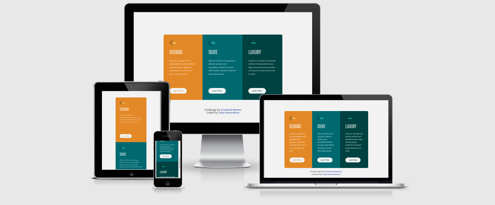

# Frontend Mentor - 3-column preview card component

The project was based on the challenge provided by [Frontend Mentor](https://www.frontendmentor.io).

This is a solution to the [Order summary card challenge on Frontend Mentor](https://www.frontendmentor.io/challenges/3column-preview-card-component-pH92eAR2-). 

## The design provided

## Table of contents

- [User Stories](#user-stories)
- [Features](#features)
- [Technologies Used](#technologies-used)
- [Design](#design)
- [Bugs](#bugs)
- [Testing](#testing)
  - [Compatibility](#compatibility)
  - [Validator testing](#validator-testing)
  - [Lighthouse Report](#lighthouse-report)
- [Deployment](#deployment)
- [Author](#author)
- [Credits](#credits)
- [Acknowledgments](#acknowledgments)

I was using design files provided for this challenge in order to make the result look as similar as possible to the provided images.

I have also added various breakpoints in order to provide the best user experience.

The solution to this challenge can be accessed by this [link](https://iuliiakonovalova.github.io/frontend-mentor-3-column-preview-card-component-main/)

---
## User Stories

### First Time Visitor Goals:

* As a First Time Visitor, I want to easily understand the main purpose of the web page, so I can learn more about this web page.
* As a First Time Visitor, I want to be able to easily navigate through the web page, so I can find the content.
* As a First Time Visitor, I want to find the web page useful.

### Frequent Visitor Goals:
* As a Frequent User, I want to see the changes in content and offers, so I can easily make a choice.

---

## Features

---